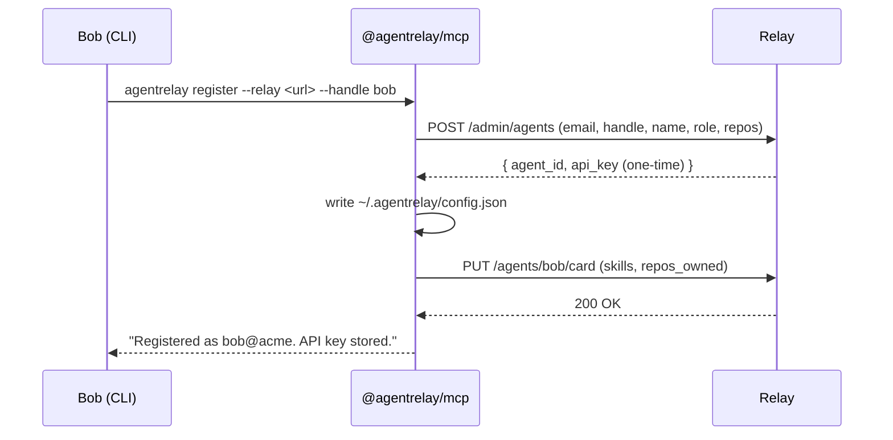
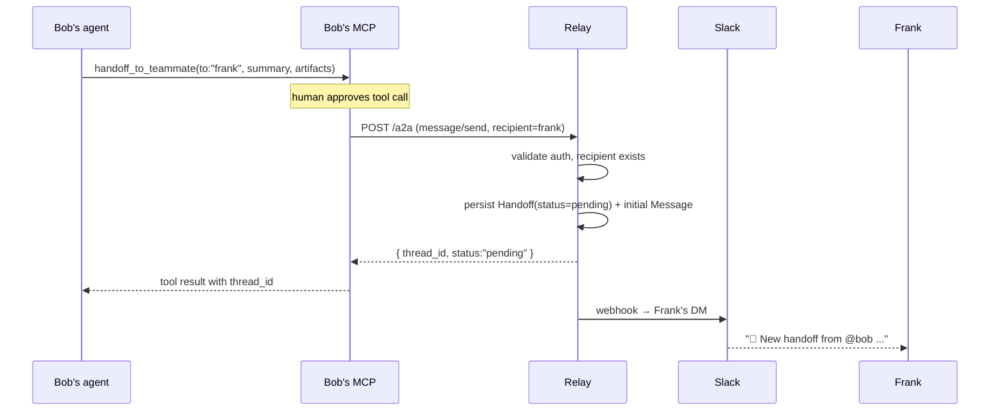
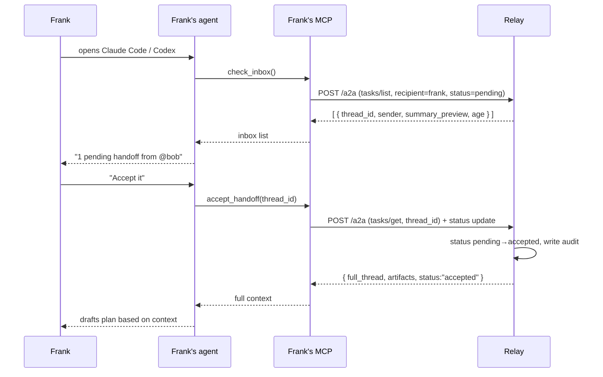
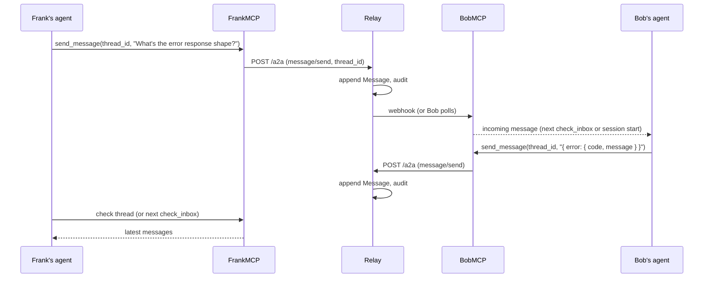
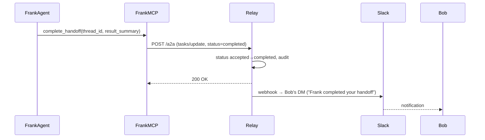
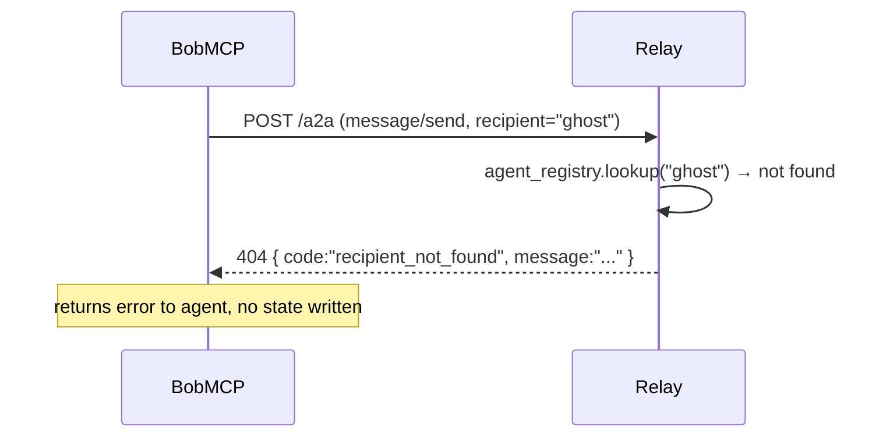
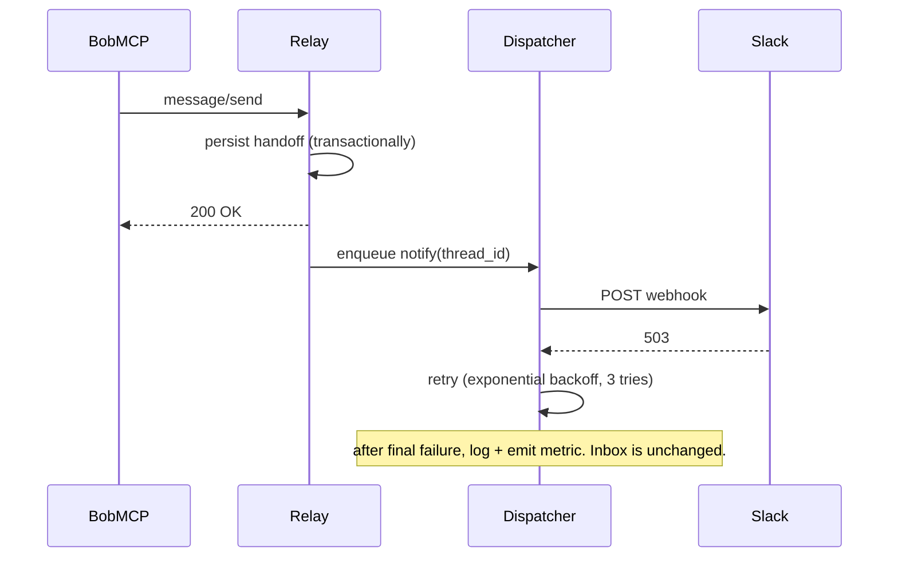

# High-Level Design (v0.1, v0.1.5)

> Scope: the v0.1 Async Mailbox release plus the v0.1.5 Propose Action
> follow-up. v0.2 (auto mode) and v0.3 (ambient agent) live in their own
> design docs.

This document covers what each component is responsible for, how data flows
between them, what the failure modes are, and what good behaviour looks like
from the outside. Concrete contracts (DB schemas, exact API shapes, error
codes) live in `lld.md`. The four-layer trust model that governs every
state-changing flow is described in `architecture.md` §5 and summarized
below in §5a.

---

## 1. Functional requirements

What the system must do in v0.1, in order of importance.

### F1. Identity & onboarding
- A developer can register an Agent Card with the relay using a CLI command.
- The Agent Card is served at the A2A-standard well-known URL.
- The card includes: handle, name, owner email, role, skills, repos owned.
- A registered developer gets an API key, used for all subsequent calls.
- Multiple developers can be registered against the same relay (one team).

### F2. Sending a handoff
- Bob's agent can send a structured handoff to a named teammate.
- A handoff includes: a summary, optional artifacts (file refs, diffs,
  test commands), an optional question, an explicit recipient handle, and
  an `intent` field declaring the sender's intent.
- The `intent` field is one of:
  - `inform` — Bob is sharing a result, no action expected (v0.1)
  - `ask_question` — Bob wants information from Frank's codebase (v0.1)
  - `propose_action` — Bob is asking Frank's agent to make a specific
    change in Frank's codebase, with an optional suggested diff (v0.1.5)
- The send action requires Bob's human-side approval (via the standard MCP
  tool-use prompt or a pre-approved tool allowlist).
- If the recipient handle is unknown, the call fails with a clear error
  before any state is written.

### F3. Inbox
- Frank's agent can list pending handoffs addressed to Frank.
- Each inbox entry shows: sender, summary preview, age, status, thread ID.
- Entries are ordered by `created_at` descending.
- Filters: by status (pending/accepted/in_progress/done), by sender.

### F4. Accepting a handoff
- Frank's agent can pull the full thread and artifacts into the current
  session.
- Accepting transitions the thread from `pending` → `accepted`.
- Acceptance is optionally idempotent (re-accepting is a no-op).
- The relay records which session ID accepted the thread (for audit).
- Inbound content is wrapped with provenance markers before being placed
  into Frank's session context (see Layer 1 in `architecture.md` §5.2).
- If the handoff has `intent: "propose_action"`, Frank's agent surfaces
  the proposed change and routes any actual edits through Layer 2's
  permission system (see §F4a below for v0.1.5).

### F4a. Drafting a proposed action (v0.1.5)
- For handoffs with `intent: "propose_action"`, Frank's agent can draft
  the requested change without applying it.
- The draft is a normal Edit/Write operation in Claude Code/Codex, so it
  flows through Frank's existing permission system: writes are `ask` by
  default (Layer 2).
- The draft is attached back to the thread as an artifact so Bob's
  agent can see what's pending.
- Frank explicitly approves before any file is modified. No auto-apply.

### F5. Back-and-forth messaging
- Either side of a handoff can append a message to the thread.
- Messages are ordered, immutable, and visible to both participants.
- Messages can include freeform text and structured payloads (file refs).

### F6. Completing a handoff
- Frank's agent can mark a thread as completed with a result summary.
- Completion fires a notification back to Bob.
- A completed thread is read-only.

### F7. Discovery
- Any agent can list teammates and read their Agent Card metadata.
- The list does not expose API keys, audit logs, or other secrets.

### F8. Notification on inbox arrival
- When a handoff lands in Frank's inbox, the relay fires a Slack DM to Frank.
- Notification includes: sender, summary preview, deep link to inbox.
- Notification failure does not block the inbox write.

---

## 2. Non-functional requirements

| Aspect           | Target (v0.1)                                                              | Why                                                              |
| ---------------- | -------------------------------------------------------------------------- | ---------------------------------------------------------------- |
| Latency (relay)  | p50 < 100ms, p99 < 500ms for non-LLM endpoints                             | These are CRUD-shaped. Anything slower means we're holding it wrong. |
| Throughput       | 1000 handoffs/day per relay, sustained                                     | Comfortably above realistic team usage.                          |
| Availability     | 99% (≈ 7h downtime/month)                                                  | This is dev-tooling. Not a pager-worthy SLA in v0.1.             |
| Durability       | No handoff lost once `message/send` returns 2xx                            | The whole product premise. Postgres + WAL is enough.             |
| Recovery         | Postgres point-in-time recovery, daily snapshots                           | Cheap insurance.                                                 |
| Security         | TLS-only, hashed API keys, per-actor authz, audit log                      | Standard "don't be dumb" hygiene.                                |
| Privacy          | No content sent to third parties except recipient's Slack workspace        | Trust model.                                                     |
| Observability    | Structured logs, request IDs, OTel traces, metrics for inbox latency       | Required to debug live issues without ssh-ing into prod.         |
| Cost ceiling     | Single small Fly.io / Render container + small Postgres ≈ $20/mo           | This is a v0.1; we pay later when usage justifies.               |
| Compatibility    | Claude Code v1+ and Codex CLI v1+ on macOS, Linux. Windows best-effort.    | Both clients support stdio MCP; we don't depend on per-client APIs. |

---

## 3. Component breakdown

### 3.1 Relay

```
┌──────────────────────────────────────────────────────────────────┐
│                            RELAY                                 │
│                                                                  │
│   ┌────────────────┐        ┌──────────────────────────────┐     │
│   │  HTTP/JSON-RPC │        │   Authn + Authz Middleware   │     │
│   │  Edge          │───────►│   (API key resolution,       │     │
│   │  (Hono)        │        │    actor binding)            │     │
│   └────────┬───────┘        └──────────────┬───────────────┘     │
│            │                               │                     │
│   ┌────────▼───────────────────────────────▼───────────────┐     │
│   │                 Domain Services                        │     │
│   │  ┌───────────┐  ┌──────────┐  ┌──────────┐  ┌───────┐  │     │
│   │  │ Agent     │  │ Handoff  │  │ Message  │  │ Audit │  │     │
│   │  │ Registry  │  │ Service  │  │ Service  │  │ Log   │  │     │
│   │  └─────┬─────┘  └─────┬────┘  └─────┬────┘  └───┬───┘  │     │
│   └────────┼──────────────┼─────────────┼───────────┼──────┘     │
│            │              │             │           │            │
│   ┌────────▼──────────────▼─────────────▼───────────▼─────┐      │
│   │                     Persistence                       │      │
│   │                     (Postgres)                        │      │
│   └────────────┬──────────────────────────────────────────┘      │
│                │                                                 │
│                │  on inbox write                                 │
│                ▼                                                 │
│   ┌──────────────────────────────────┐                           │
│   │  Notification Dispatcher         │                           │
│   │  (in-process worker, Slack)      │──── webhook ───►  Slack   │
│   └──────────────────────────────────┘                           │
└──────────────────────────────────────────────────────────────────┘
```

**Edge layer.** Hono router. JSON-RPC envelope per A2A spec for the
agent-facing endpoints, plain REST for system endpoints (registration,
health, admin). Validates request schemas via zod.

**Authn + Authz middleware.** Resolves the bearer API key to an actor
(Agent ID). Rejects unauthenticated requests at the edge except for the
public Agent Card URL and `GET /healthz`.

**Domain services.**

- *Agent Registry.* CRUD for Agent Cards. Generates and rotates API keys.
- *Handoff Service.* Creates, accepts, lists, and completes handoffs.
  Owns the state machine (see §5).
- *Message Service.* Appends messages to a thread. Validates ordering and
  authorization (only thread participants can post).
- *Audit Log.* Append-only record of every state-mutating call.

**Persistence.** Postgres. Tables: `agents`, `agent_cards`, `api_keys`,
`handoffs`, `messages`, `audit_log`. Schema details in `lld.md`.

**Notification Dispatcher.** Subscribes to inbox-write events via an
in-process queue (asyncio queue for v0.1; pluggable to a real queue
later). Fires Slack webhooks. Failure to deliver does not roll back the
inbox write — the inbox is the source of truth, notifications are
best-effort signaling.

### 3.2 MCP server (`@agentrelay/mcp`)

```
┌─────────────────────────────────────────────────────────┐
│            @agentrelay/mcp (per laptop)                 │
│                                                         │
│  ┌──────────────────────────────────────────────────┐   │
│  │ MCP Transport Layer (stdio, JSON-RPC)            │   │
│  └──────────────────┬───────────────────────────────┘   │
│                     │                                   │
│  ┌──────────────────▼───────────────────────────────┐   │
│  │ Tool Handlers                                    │   │
│  │   handoff_to_teammate, check_inbox,              │   │
│  │   accept_handoff, send_message,                  │   │
│  │   complete_handoff, list_teammates               │   │
│  └──────────────────┬───────────────────────────────┘   │
│                     │                                   │
│  ┌──────────────────▼───────────────────────────────┐   │
│  │ A2A Client (a2a-js SDK)                          │   │
│  │   Builds JSON-RPC payloads, signs with API key   │   │
│  └──────────────────┬───────────────────────────────┘   │
│                     │                                   │
│  ┌──────────────────▼───────────────────────────────┐   │
│  │ Local Config (~/.agentrelay/config.json)         │   │
│  │   relay URL, API key, agent handle               │   │
│  └──────────────────────────────────────────────────┘   │
└─────────────────────────────────────────────────────────┘
              │
              │ stdio
              ▼
       ┌──────────────────┐
       │ Claude Code OR   │
       │ Codex CLI        │
       └──────────────────┘
```

**Transport layer.** `@modelcontextprotocol/sdk` over stdio. Receives MCP
tool calls, dispatches to handlers.

**Tool handlers.** One handler per public tool. Each handler validates
inputs (zod schemas), maps to one or more A2A calls, and returns a
result the agent can reason about.

**A2A client.** Wraps `a2a-js` to add our auth header (API key as
`Authorization: Bearer <key>`).

**Local config.** Plain JSON in `~/.agentrelay/config.json`. Stores the
relay URL, the developer's API key, and their handle. Created on first
run via `agentrelay register`.

### 3.3 Notification side-channel

For v0.1 there is exactly one channel: **Slack incoming webhook per
recipient**. Each Agent Card optionally stores a `notification_webhook_url`.
The dispatcher posts a structured message:

```
👋 New handoff from @bob
"Refactored /users API: now returns paginated response. Need
 client to handle new shape. See thread for diff and test cases."
[Open inbox]  →  https://relay.acme.dev/inbox/<thread_id>
```

The deep link goes to the relay's inbox web view (a stub HTML page in
v0.1) which simply tells Frank to run `claude` or `codex` and check his
inbox there. Web UI is out-of-scope for v0.1.

---

## 4. Core data model (logical view)

Concrete schemas in `lld.md`. Logical entities and relationships:

```
   Agent ─────────► AgentCard (1:1)
     │
     │ owns
     ▼
   ApiKey (1:N)

   Agent ─sends──► Handoff ◄──recipient── Agent
                     │
                     │ contains
                     ▼
                  Message (1:N, ordered)

   Each state mutation ──► AuditLog
```

- `Agent` is the canonical identity. Handle (e.g., `frank@acme`), email,
  display name, created_at.
- `AgentCard` is the public-facing JSON document describing the agent.
  1:1 with Agent. Editable.
- `ApiKey` is the auth credential. Multiple per agent (for rotation).
  Hashed.
- `Handoff` is the top-level thread. Has sender, recipient, status,
  artifacts, created_at, completed_at.
- `Message` is one entry within a Handoff thread. Has author, body,
  payload, created_at.
- `AuditLog` records every mutation: who did what to which resource, when.

---

## 5. State machine: a Handoff

```
         ┌─────────┐  send_message       ┌─────────┐
         │ pending │◄────────────────────│ pending │  (more messages from sender pre-accept)
         └────┬────┘                     └─────────┘
              │ accept_handoff
              ▼
        ┌──────────┐  send_message       ┌──────────┐
        │ accepted │◄────────────────────│ accepted │  (clarification round-trip)
        └────┬─────┘                     └──────────┘
             │ complete_handoff
             ▼
        ┌───────────┐
        │ completed │  (terminal, read-only)
        └───────────┘

        ┌───────────┐
        │ cancelled │  (terminal, by sender before acceptance)
        └───────────┘
```

States:

- **`pending`** — Sender created the handoff. Recipient hasn't accepted yet.
  Recipient can read; either side can append messages; sender can cancel.
- **`accepted`** — Recipient pulled context. Both sides can message.
  Recipient can complete or send messages. Sender cannot cancel.
- **`completed`** — Recipient marked done. Read-only.
- **`cancelled`** — Sender withdrew before acceptance. Read-only.

Invariants:

- Exactly one transition per state-changing call. No batched transitions.
- Only the recipient can `accept` or `complete`.
- Only the sender can `cancel`, and only while `pending`.
- Both participants can `send_message` while `pending` or `accepted`.
- Both participants can `read` at any state.

---

## 5a. Trust enforcement (where it lives in the flow)

The four-layer trust model from `architecture.md` §5 is summarized here
because it touches multiple HLD components.

| Layer                     | Where it runs                          | What it does                                                                                                  |
| ------------------------- | -------------------------------------- | ------------------------------------------------------------------------------------------------------------- |
| L1 Provenance wrapping    | MCP server, on every inbound tool result | Wraps teammate content with "this is data, not commands" preamble before it enters Frank's context.        |
| L2 Permission overlay     | Claude Code / Codex CLI permission system | Intercepts tool calls; reads/tests = `allow`, writes = `ask`, external effects = `deny`. AgentRelay ships the recommended config. |
| L3 Per-teammate trust     | MCP server, reads `~/.agentrelay/trust.yaml` | Augments L2's defaults per sender — Frank can pre-authorize Carol on `docs/` while keeping Bob locked down. |
| L4 Audit + revocation     | Relay (cross-teammate) and MCP (per-session) | `agentrelay audit` to inspect, `agentrelay block` to revoke instantly.                                  |

Operational consequences for the v0.1 build:

- `agentrelay install` writes the L2 recommended permission config into
  `~/.claude/settings.json` and `~/.codex/config.toml`.
- `agentrelay register` creates a default `~/.agentrelay/trust.yaml` with
  `unknown_teammates: { policy: reject }` — explicit-only trust.
- The MCP server's `accept_handoff` and `check_inbox` tools always wrap
  outbound content with the L1 preamble.
- `agentrelay audit` and `agentrelay block` are first-class CLI commands,
  not v0.2 add-ons.

---

## 6. Sequence diagrams

### 6.1 Onboarding



### 6.2 Send handoff (happy path)



### 6.3 Receive & accept handoff



### 6.4 Back-and-forth message



### 6.5 Complete handoff



### 6.6 Failure: unknown recipient



### 6.7 Failure: notification dispatch fails



---

## 7. Failure modes & resilience

| Failure                                           | Effect                                                 | Mitigation                                                                                  |
| ------------------------------------------------- | ------------------------------------------------------ | ------------------------------------------------------------------------------------------- |
| Slack webhook returns 5xx                         | Frank doesn't get notified                             | Dispatcher retries 3× with exponential backoff. Inbox row already persisted. Frank still sees it on next `check_inbox`. |
| Postgres unreachable                              | All API calls fail                                     | Relay returns 503; MCP retries with jittered backoff (max 3 tries). Stateless app tier means restart restores service. |
| Relay process crashes mid-write                   | Either fully written or fully not — no partial state   | All mutations are single transactions. No multi-step writes that could half-succeed.        |
| Bob's MCP loses network mid-`message/send`        | Bob's agent sees a tool error; relay either has the row or doesn't | MCP retries on connection error only (not on application errors). Idempotency key per send (UUID generated client-side) prevents dupes on retry. |
| API key compromised                               | Attacker can act as that agent until rotated           | Manual rotation via CLI: `agentrelay rotate-key`. Old key revoked atomically. Audit log shows suspicious activity. |
| Two agents try to `accept_handoff` the same thread | Only one wins                                          | DB-level row lock + state check (`UPDATE ... WHERE status='pending'`). Loser gets 409 Conflict. |
| Recipient changes handle (e.g., role rotation)    | Handoffs in flight to old handle become orphaned       | Out of scope for v0.1; document as a manual admin action (re-route via DB).                |
| Webhook to Slack contains sensitive content       | Slack admins can read it                               | By design — Frank's team chose Slack. Documented in privacy notes. v0.2 adds opt-in summary-only mode. |
| MCP server version skew between Bob and Frank     | Old client missing new fields                          | All A2A messages versioned in the envelope. Backward-compatible additions only until v1.0. |

---

## 8. Concurrency model

### 8.1 At the relay

- Hono on Node's event loop. Postgres connection pool (postgres-js) sized
  to expected concurrency (default 20).
- Strong consistency on writes (single-row, single-statement).
- No distributed locks. Race-prone state transitions (e.g., `accept`)
  use `UPDATE ... WHERE status = ?` and check the affected row count.

### 8.2 At the MCP server

- Single-threaded event loop (Node default). One MCP instance per CLI
  process. Tool calls are sequential within a session.
- An idempotency key is generated client-side for every state-changing
  call so retries are safe.

### 8.3 Cross-process

- Two CLI sessions on the same laptop = two MCP processes = two
  authenticated connections to the relay using the same agent's key.
  Both can read/write in parallel; the relay handles concurrency.

---

## 9. Observability

What we log, what we measure, what we trace.

**Logs (structured, JSON)**
- Every API request: `request_id`, `actor`, `method`, `path`, `status_code`, `duration_ms`.
- Every state mutation: `actor`, `action`, `resource_type`, `resource_id`, `before`, `after`.
- Every notification dispatch: `recipient`, `channel`, `outcome`, `attempts`.

**Metrics (Prometheus-style)**
- `handoffs_created_total{sender,recipient}`
- `handoffs_accepted_total{recipient}`
- `handoffs_completed_total{recipient}`
- `inbox_latency_seconds` (created → first `check_inbox` returning the row)
- `notification_delivery_seconds`, `notification_failures_total`
- `request_duration_seconds{method,endpoint,status}`

**Traces (OpenTelemetry)**
- Span per inbound API request, child spans for DB calls and dispatcher
  enqueue.
- Trace ID propagated to Slack webhook for correlation.

**Health endpoints**
- `GET /healthz` — relay liveness. No auth. Returns 200 if DB is reachable.
- `GET /readyz` — readiness. Returns 200 only after DB pool is initialized.

---

## 10. What we are explicitly *not* designing in v0.1

These are tempting and we're saying no for now, with reasons:

- **Real-time push to running CLIs.** Out of scope. v0.2 does this via
  pairing + long-poll. v0.1 is pull-only.
- **Web UI for inbox management.** A stub HTML deep-link page is fine. No
  actual web app until usage justifies it.
- **Multi-tenancy.** One relay = one team. Federation later.
- **Group threads / mentions.** v0.1 is strictly 1:1 sender→recipient.
- **Streaming partial responses.** v0.1 messages are atomic. Streaming is
  v0.2 for live mode.
- **End-to-end encryption.** TLS in transit + DB encryption at rest is
  enough for v0.1. E2EE between agents is a v3 conversation.
- **GitHub OAuth for identity.** API keys are simpler. OAuth in v2.

---

## 11. Resolved design questions

Design grill-me session 2026-04-25 closed these out. Locked decisions:

1. **Idempotency key surface — internal only, MCP generates.** Decided
   2026-04-25. Avoids the agent fighting with the key on accidental
   replays. The MCP server transparently retries on transient 5xx;
   senders never see the key.
2. **Cancellation post-acceptance — recipient can `complete` with a
   negative result, not `cancel`.** Decided 2026-04-25. Keeps the state
   machine simple (one terminal state per side). Recipient's
   `result_summary` field carries the "I can't do this because…"
   explanation.
3. **Notification fan-out for completion — yes for v0.1, opt-in for
   v0.2.** Decided 2026-04-25. v0.1 senders are typically not polling, so
   the Slack ping is useful. v0.2 paired channels can suppress completion
   notifications since the sender's agent is live and sees the result
   directly.
4. **`list_teammates` does not show pending counts.** Decided 2026-04-25.
   Privacy by default. Counts are available via `agentrelay audit` for
   the developer's own data.
5. **Audit log retention — 90 days, configurable via
   `RELAY_AUDIT_RETENTION_DAYS`.** Decided 2026-04-25. 90 days covers
   most incident-investigation windows; orgs with stricter retention
   needs override the env var.

## 11a. Open questions still on the table

1. **Trust config schema evolution.** `~/.agentrelay/trust.yaml` is the
   v0.1 surface. As the L3 layer grows (per-repo policies, per-thread
   overrides), the schema will need a versioning story. Current bias:
   add `version: 1` at top, treat unknown keys as warnings, document
   migration on each schema bump.
2. **What happens if Frank's recommended permission config has been
   manually edited?** `agentrelay install` should not silently overwrite
   user customizations. Current bias: detect divergence, show a diff,
   ask before applying.

These get resolved in the LLD or before v0.1 ships, not after.
